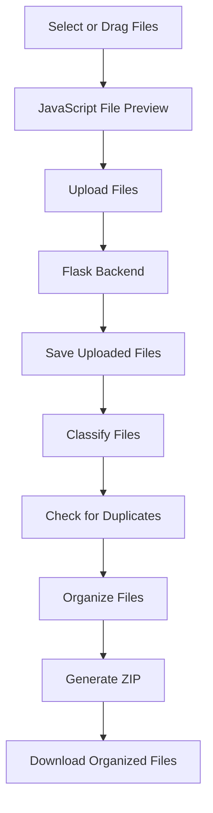

# 📂 DropSort


**DropSort** is a Flask-based file organization web application that helps users
sort messy files into meaningful categories through a simple drag-and-drop
interface.

Users can select files, preview them, upload them to the Flask backend,
automatically categorize them, organize them into folders, and generate
downloadable organized files.

---

## ✨ Features

### Current Features

- **Drag-and-Drop File Upload** — Select or drag files directly into the
  browser.
- **File Preview** — Preview selected files before uploading.
- **File Metadata** — Display file name, extension, size, and detected category.
- **Selection Management** — Remove individual files or clear the complete
  selection.
- **Flask Backend Integration** — Handles file uploads and processing through
  Flask.
- **File Classification** — Categorizes files primarily by their file
  extensions.
- **Automatic Organization** — Moves files into category-specific directories.
- **Duplicate Detection** — Detects duplicate files using file hashing.
- **ZIP Generation** — Creates an organized ZIP archive from processed files.
- **Download Support** — Provides the generated organized files for download.

### Supported Categories

- 🖼️ Images
- 📄 Documents
- 📊 Spreadsheets
- 📽️ Presentations
- 💻 Code
- 🌐 Web
- 🗄️ Databases
- 🎵 Audio
- 🎥 Videos
- 🗜️ Archives
- ⚙️ Executables
- 🛠️ System/Config
- 🔤 Fonts
- 🎨 Design
- 🧊 3D/CAD
- 📚 eBooks
- 📈 Data
- 📝 Subtitles
- 📓 Notebooks
- 📁 Other

---

## 🛠️ Tech Stack

| Technology      | Role                                                       |
| :-------------- | :--------------------------------------------------------- |
| **Python 3**    | Core backend logic                                         |
| **Flask**       | Web framework and routing                                  |
| **HTML5**       | Web page structure                                         |
| **CSS3**        | Custom styling                                             |
| **JavaScript**  | Drag-and-drop, file previews, and client-side interactions |
| **Bootstrap 5** | Responsive UI components                                   |

---

## 🏗️ Project Structure

```text
dropsort/
│
├── app.py                         # Main Flask application
├── requirements.txt               # Python dependencies
├── README.md                      # Project documentation
├── .gitignore                     # Git ignore rules
│
├── routes/                        # Flask route modules
│   ├── upload.py                  # File upload handling
│   ├── organize.py                # File organization handling
│   └── download.py                # Download handling
│
├── services/                      # Core application logic
│   ├── duplicate_detector.py      # Duplicate file detection
│   ├── file_classifier.py         # File category detection
│   ├── file_organizer.py          # File organization logic
│   └── zip_generator.py           # Organized ZIP generation
│
├── static/
│   ├── css/
│   │   └── style.css              # Custom styles
│   └── js/
│       └── app.js                 # Frontend interactions
│
└── templates/
    └── index.html                 # Main web interface
```

> Runtime folders such as uploaded files, organized files, downloads, and test
> files are excluded from Git using `.gitignore`.

---

## 🚀 Setup & Installation

### Prerequisites

Make sure **Python 3.x** is installed.

Check your Python version:

```powershell
python --version
```

### 1. Clone the Repository

```powershell
git clone https://github.com/Mah3sh-Kumar/DropSort.git
cd DropSort
```

### 2. Create a Virtual Environment

```powershell
python -m venv .venv
```

### 3. Activate the Virtual Environment

For **Windows PowerShell**:

```powershell
.\.venv\Scripts\Activate.ps1
```

For **Command Prompt**:

```cmd
.venv\Scripts\activate.bat
```

### 4. Install Dependencies

```powershell
python -m pip install -r requirements.txt
```

---

## 💻 Run the Application

Make sure the virtual environment is active, then run:

```powershell
python app.py
```

The Flask development server should start at:

```text
http://127.0.0.1:5000
```

Open that address in your browser.

---

## ⚙️ How It Works



### Processing Flow

1. The user selects or drags files into the web interface.
2. JavaScript displays the selected files and their metadata.
3. Files are uploaded to the Flask backend.
4. The backend classifies files into categories.
5. Duplicate files can be detected during processing.
6. Files are organized into appropriate folders.
7. An organized ZIP archive can be generated.
8. The resulting file can be downloaded.

---

## 📂 File Categorization

DropSort primarily categorizes files using their file extensions.

Examples:

| Example File  | Category     |
| :------------ | :----------- |
| `resume.pdf`  | 📄 Documents |
| `photo.jpg`   | 🖼️ Images    |
| `main.py`     | 💻 Code      |
| `song.mp3`    | 🎵 Audio     |
| `movie.mp4`   | 🎥 Videos    |
| `backup.zip`  | 🗜️ Archives  |
| `data.xyz123` | 📁 Other     |

---

## 🔒 Security Notes

DropSort is currently intended as a **local development/educational project**.

Before deploying the application publicly, consider implementing:

- File-size limits
- Filename and path validation
- Allowed file-extension restrictions
- Temporary-file cleanup
- Authentication if required
- Malware/security scanning for uploaded files
- Production WSGI server configuration such as Gunicorn or Waitress
- Additional protection against malicious file uploads

---

## 📌 Development Status

DropSort is currently under **active development** as a personal/educational
project.

The current implementation includes the frontend interface, Flask backend, file
upload workflow, file classification, organization, duplicate detection, ZIP
generation, and download functionality.

Additional improvements are planned for security, file detection, progress
feedback, and UI/UX.

---

## 👨‍💻 Author

**Mahesh Kumar**

GitHub: [Mah3sh-Kumar](https://github.com/Mah3sh-Kumar)

---

## 📝 License

This project is currently developed for educational and personal purposes.
