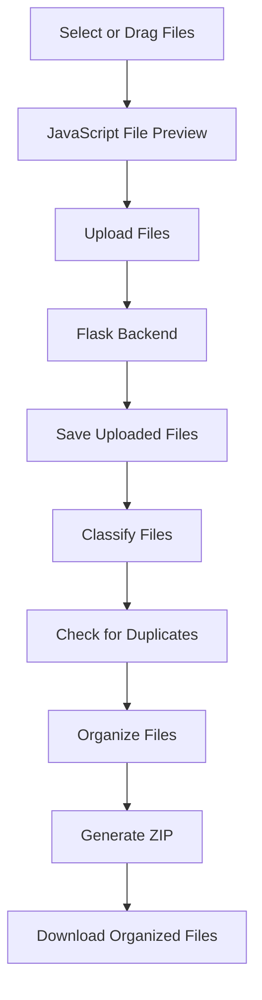

# 📂 DropSort


## 📌 About

**DropSort** is a personal Flask-based file organization project developed by
**Mahesh Kumar**.

The project provides a web interface for selecting or dragging files, previewing
them, uploading them to a Flask backend, classifying them into categories,
detecting duplicates, organizing them into folders, and generating a
downloadable ZIP archive.

> **Personal Project Notice:** DropSort is an independently developed
> personal/educational project. The source code, original design,
> implementation, documentation, and project structure are the intellectual
> property of **Mahesh Kumar**, unless otherwise stated.

---

## ✨ Features

### Current Features

- **Drag-and-Drop File Upload** — Select or drag files directly into the
  browser.
- **File Preview** — Preview selected files before uploading.
- **File Metadata** — Display file name, extension, size, and detected category.
- **Selection Management** — Remove individual files or clear the complete
  selection.
- **Flask Backend Integration** — Handles file uploads and processing through
  Flask.
- **File Classification** — Categorizes files using file extensions and
  file-signature detection.
- **Automatic Organization** — Organizes files into category-specific
  directories.
- **Duplicate Detection** — Detects duplicate files using file hashing.
- **Duplicate Handling** — Supports multiple duplicate-handling options.
- **ZIP Generation** — Creates an organized ZIP archive from processed files.
- **Download Support** — Provides the generated organized files for download.
- **Responsive UI** — Designed for desktop and mobile browsers.
- **Dark/Light Theme** — Theme switching for the user interface.
- **Features & How-to-Use Pages** — Includes dedicated project documentation
  pages.

### Supported Categories

- 🖼️ Images
- 📄 Documents
- 📊 Spreadsheets
- 📽️ Presentations
- 💻 Code
- 🌐 Web
- 🗄️ Databases
- 🎵 Audio
- 🎥 Videos
- 🗜️ Archives
- ⚙️ Executables
- 🛠️ System/Config
- 🔤 Fonts
- 🎨 Design
- 🧊 3D/CAD
- 📚 eBooks
- 📈 Data
- 📝 Subtitles
- 📓 Notebooks
- 📁 Other

---

## 🛠️ Tech Stack

| Technology      | Role                                                           |
| :-------------- | :------------------------------------------------------------- |
| **Python 3**    | Core backend logic                                             |
| **Flask**       | Web framework and routing                                      |
| **HTML5**       | Web page structure                                             |
| **CSS3**        | Custom styling                                                 |
| **JavaScript**  | Drag-and-drop, previews, uploads, and client-side interactions |
| **Bootstrap 5** | Responsive UI components                                       |

---

## 🏗️ Project Structure

```text
dropsort/
│
├── app.py
├── requirements.txt
├── README.md
├── LICENSE
├── .gitignore
│
├── routes/
│   ├── upload.py
│   ├── organize.py
│   └── download.py
│
├── services/
│   ├── duplicate_detector.py
│   ├── file_classifier.py
│   ├── file_organizer.py
│   ├── file_signature_detector.py
│   └── zip_generator.py
│
├── static/
│   ├── css/
│   │   └── style.css
│   └── js/
│       ├── app.js
│       └── theme.js
│
└── templates/
    ├── index.html
    ├── features.html
    └── how_to_use.html
```

Runtime folders such as uploaded files, organized files, generated downloads,
and test files are excluded from Git using `.gitignore`.

---

## 🚀 Setup & Installation

### Prerequisites

Make sure **Python 3.x** is installed.

```powershell
python --version
```

### 1. Clone the Repository

```powershell
git clone https://github.com/Mah3sh-Kumar/DropSort.git
cd DropSort
```

### 2. Create a Virtual Environment

```powershell
python -m venv .venv
```

### 3. Activate the Virtual Environment

**Windows PowerShell:**

```powershell
.\.venv\Scripts\Activate.ps1
```

**Command Prompt:**

```cmd
.venv\Scripts\activate.bat
```

### 4. Install Dependencies

```powershell
python -m pip install -r requirements.txt
```

---

## 💻 Run the Application

```powershell
python app.py
```

Open:

```text
http://127.0.0.1:5000
```

---

## ⚙️ How It Works



### Processing Flow

1. The user selects or drags files into the web interface.
2. JavaScript displays the selected files and their metadata.
3. Files are uploaded to the Flask backend.
4. The backend classifies the files.
5. Duplicate files are detected during processing.
6. Files are organized into appropriate categories.
7. An organized ZIP archive is generated.
8. The resulting archive can be downloaded.

---

## 📂 File Categorization

DropSort uses file extensions and file-signature detection to help determine
file categories.

| Example File  | Category     |
| :------------ | :----------- |
| `resume.pdf`  | 📄 Documents |
| `photo.jpg`   | 🖼️ Images    |
| `main.py`     | 💻 Code      |
| `song.mp3`    | 🎵 Audio     |
| `movie.mp4`   | 🎥 Videos    |
| `backup.zip`  | 🗜️ Archives  |
| `data.xyz123` | 📁 Other     |

---

## 🔒 Security & Deployment Notes

DropSort is a personal/educational project. Before public deployment, additional
protections should be considered, including file-size limits, filename/path
validation, allowed file-type restrictions, temporary-file cleanup, protection
against malicious archives, authentication where appropriate, malware/security
scanning, production WSGI configuration, rate limiting, and abuse protection.

---

## 🚧 Development Status

DropSort is an actively developed personal project. The current implementation
includes the frontend interface, responsive UI, dark/light theme, Flask backend,
file upload workflow, file classification, file-signature detection, file
organization, duplicate detection and handling, ZIP generation, download
functionality, Features page, and How-to-Use page.

Further improvements may be added during development.

---

## 👨‍💻 Author

**Mahesh Kumar**

Personal project developed and maintained by Mahesh Kumar.

GitHub: https://github.com/Mah3sh-Kumar

---

## © Copyright & Usage Restrictions

**Copyright © 2026 Mahesh Kumar. All Rights Reserved.**

DropSort is a **proprietary personal project**. No permission is granted to
copy, reproduce, redistribute, republish, modify, create derivative works from,
commercially use, or claim as your own any part of the DropSort source code,
original UI/design, documentation, or implementation without prior written
permission from Mahesh Kumar.

You may view the public repository for personal evaluation, learning, and
reference. Viewing the repository does **not** grant permission to copy, reuse,
modify, redistribute, publish, or commercially exploit the project.

For permission to reuse any part of DropSort, contact the author first.

**All rights reserved.**

---

## 📄 License

This repository is distributed under a **proprietary, all-rights-reserved
license**.

See [`LICENSE`](LICENSE) for the complete terms.

> Third-party libraries, frameworks, icons, fonts, and other dependencies remain
> subject to their respective licenses.
